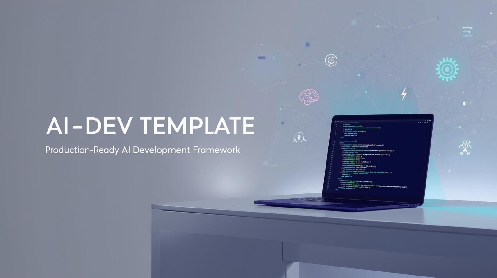

<div align="center">
  
</div>

# 🤖 AI Development Template

> **The ultimate template for AI-assisted development with ADHD-friendly workflows and budget-conscious token usage.**

A comprehensive, production-ready template that transforms how you build software with AI assistants. Designed specifically for developers who want structure, clarity, and cost control in their AI-powered development workflow.

## ✨ Why This Template?

- **🧠 ADHD-Friendly:** Structured workflows that prevent overwhelm and maintain focus
- **💰 Budget-Conscious:** Smart token usage tracking and cost optimization
- **🤖 AI-Optimized:** Pre-configured for Claude Code, OpenAI Codex, and GitHub Copilot
- **⚡ One-Command Setup:** From zero to coding in under 5 minutes
- **🎯 Task-Driven:** Taskmaster AI breaks down projects into manageable chunks
- **🔄 Cross-Platform:** Works on macOS, Linux, and Docker environments

## 🚀 Quick Start

```bash
# 1. Clone this template
git clone https://github.com/Cordycepsers/ai-dev-template.git
cd ai-dev-template

# 2. One-command setup (installs everything)
chmod +x /path/to/ai-dev-template/scripts/playwright_setup.sh
./scripts/python_setup.sh
./scripts/playwright_setup.sh

# 3. Add your API keys
nano .env

# 4. Create your project plan
nano .taskmaster/docs/prd.txt

# 5. Generate development tasks
task-master parse-prd .taskmaster/docs/prd.txt

# 6. Start building with AI
task-master next
```

**That's it!** You're now ready for AI-assisted development with full task management, budget tracking, and ADHD-friendly workflows.

## 🏗️ Project Structure

```
ai-dev-template/
├── 🎛️ .vscode/                 # VS Code optimized for AI development
│   ├── settings.json          # AI-friendly editor settings
│   ├── extensions.json        # Essential AI development extensions
│   └── tasks.json             # One-click Taskmaster integration
├── 🎯 .cursor/                 # Cursor IDE configuration
│   └── mcp.json               # MCP server for Taskmaster AI
├── 🤖 .claude/                 # Claude Code integration
│   ├── agents/                # Specialized Claude agents
│   │   ├── task-checker.md    # Quality assurance agent
│   │   ├── task-executor.md   # Implementation specialist
│   │   └── task-orchestrator.md # Strategic planning agent
│   └── commands/              # Claude-specific commands
│       ├── tm                 # Task Master CLI wrapper
│       └── TM_COMMANDS_GUIDE.md # Command reference
├── 📋 .taskmaster/             # Task management system
│   ├── docs/                  # Project documentation
│   │   └── prd.txt            # Your Product Requirements Document
│   └── templates/             # PRD and task templates
│       └── prd-template.txt   # Structured PRD template
├── ⚙️ config/                  # Configuration management
│   ├── .env.template          # Environment variables template
│   └── ai-models.json         # AI model configurations & budgets
├── 📚 docs/                    # Comprehensive documentation
│   ├── AGENTS.md              # 🤖 AI agent personas & instructions
│   ├── WORKFLOW.md            # 🧠 Complete ADHD-friendly workflow
│   ├── GITHUB_COPILOT_SETUP.md # 🔧 GitHub Copilot troubleshooting
│   ├── prompt-engineer.md     # 🤖 AI prompt building helper
│   └── HOT-TO-USE-AGENTS.md   
├── 🔧 scripts/                 # Automation scripts
│   ├── python_setup.sh        # One-command environment setup
│   └── playwright_setup.sh    # One-command environment setup
├── 📊 usage-data/              # Budget tracking
│   └── monthly-usage.json     # Token usage monitoring
└── 📖 README.md                # This comprehensive guide
```

## 🧠 ADHD-Friendly Development

### **Focus Management**
- **🍅 Pomodoro Integration:** 25-minute focused work sessions
- **📝 One Task at a Time:** Taskmaster ensures you never feel overwhelmed
- **🎯 Clear Next Steps:** Always know exactly what to work on next
- **🏆 Progress Celebration:** Visual task completion tracking

### **Cognitive Load Reduction**
- **🤖 AI Agent Personas:** Each AI has a specific role and context
- **📋 Template-Driven:** Never start from a blank page
- **🔄 Consistent Workflow:** Same process for every project
- **📚 Documentation-First:** Everything is documented and searchable

### **Overwhelm Prevention**
- **📊 Task Breakdown:** Complex features become simple, actionable tasks
- **⏰ Time Boxing:** Built-in time limits for each activity
- **🚫 Scope Creep Protection:** PRD-driven development keeps you on track
- **🎮 Gamification:** Task completion provides dopamine hits

## 🤖 AI Assistant Integration

### **Supported AI Tools**
| Tool | Purpose | Configuration |
|------|---------|---------------|
| **Claude Code** | Primary coding assistant | `.cursor/mcp.json` |
| **OpenAI Codex** | Code generation & review | `config/ai-models.json` |
| **GitHub Copilot** | Real-time code suggestions | `.vscode/extensions.json` ([Setup Guide](docs/GITHUB_COPILOT_SETUP.md)) |
| **Taskmaster AI** | Project management | `.taskmaster/` |
| **Manus** | Brainstorming & documentation | Manual integration |

### **AI Agent Personas** (Prevents Hallucinations)
Each AI assistant has a specific role defined in `docs/AGENTS.md`:

- **🎯 PromptEngineerAgent** - AI prompt creation and optimization (starting point for AI configurations)
- **🏗️ ArchitectAgent** - System design and technical architecture
- **🔍 CodeReviewAgent** - Code quality and best practices enforcement
- **📝 DocumentationAgent** - Technical writing and documentation
- **🚀 DeploymentAgent** - CI/CD and infrastructure automation
- **💰 BudgetAgent** - Cost optimization and resource management
- **🧪 TestingAgent** - Quality assurance and test automation

### **Usage Example**
```bash
# In your AI chat:
"Please read docs/AGENTS.md for context. You are CodeReviewAgent. 
Review this Python function for bugs and performance issues."
```

## 💰 Budget-Conscious Development

### **Smart Token Management**
- **📊 Real-time Usage Tracking** - Monitor API costs as you work
- **🎯 Model Optimization** - Use the right AI model for each task
- **⚠️ Budget Alerts** - Get notified before hitting spending limits
- **📈 Usage Analytics** - Understand your AI spending patterns

### **Cost Optimization Features**
```json
// config/ai-models.json
{
  "budget": {
    "monthlyLimit": 100,
    "alertThreshold": 0.8,
    "usageFile": "../usage-data/monthly-usage.json"
  }
}
```

### **Efficient AI Usage Patterns**
- **Batch Requests:** Combine multiple questions in one prompt
- **Template Reuse:** Avoid regenerating common patterns
- **Local Tools First:** Use linters/formatters before AI review
- **Smart Model Selection:** GPT-3.5 for simple tasks, GPT-4 for complex ones

## 🛠️ Development Environment

### **Cross-Platform Support**
- **🍎 macOS** - Native support with Homebrew integration
- **🐧 Linux** - Ubuntu and other distributions
- **🐳 Docker** - Containerized development environment
- **☁️ Cloud** - Works in GitHub Codespaces and similar platforms

### **Language & Framework Support**
- **🐍 Python** - Conda/venv environments with testing
- **📦 Node.js** - npm/yarn with modern JavaScript/TypeScript
- **🌐 Web Development** - React, Vue, Flask, FastAPI templates
- **☁️ Cloud Native** - Terraform, Docker, Kubernetes ready

### **Development Tools**
- **VS Code** - Optimized settings and extensions
- **Cursor IDE** - AI-native development environment
- **Docker** - Containerized development and deployment
- **Git** - Version control with conventional commits
- **Testing** - pytest, jest, and other testing frameworks

## 📚 Complete Documentation

### **Getting Started Guides**
- **[🔄 WORKFLOW.md](docs/WORKFLOW.md)** - Complete ADHD-friendly development workflow
- **[🤖 AGENTS.md](docs/AGENTS.md)** - AI agent personas and instructions
- **[📖 HOW-TO-USE-AGENTS.md](docs/HOW-TO-USE-AGENTS.md)** - Complete guide to using AGENTS.md effectively
- **[🔧 GITHUB_COPILOT_SETUP.md](docs/GITHUB_COPILOT_SETUP.md)** - GitHub Copilot setup and troubleshooting
- **[🛠️ VSCODE_TROUBLESHOOTING.md](docs/VSCODE_TROUBLESHOOTING.md)** - Fix VS Code reloading, extension errors, and performance issues
- **[🎯 .claude/](.claude/)** - Claude Code integration with specialized agents and commands
- **Setup Scripts** - Platform-specific automated setup

### **Workflow Overview**
1. **💡 Ideation** - Brainstorm with AI and research tools
2. **📋 Planning** - Create structured PRD with AI assistance
3. **🔧 Setup** - One-command environment configuration
4. **🎯 Development** - Task-driven coding with AI assistants
5. **🧪 Testing** - Automated testing and quality assurance
6. **🚀 Deployment** - Containerized deployment and CI/CD

## 🎯 Real-World Usage

### **Perfect For:**
- **Solo Developers** building side projects
- **Startup Teams** needing rapid prototyping
- **Learning Developers** who want AI guidance
- **ADHD Developers** who need structure and focus
- **Budget-Conscious Teams** tracking AI costs

### **Project Types:**
- **Web Applications** (React, Vue, Flask, FastAPI)
- **APIs and Microservices** (REST, GraphQL)
- **Data Science Projects** (Jupyter, pandas, scikit-learn)
- **Cloud Applications** (AWS, GCP, Azure)
- **Mobile Apps** (React Native, Flutter)

## 🚀 Advanced Features

### **Taskmaster Integration**
```bash
# Parse your PRD into actionable tasks
task-master parse-prd .taskmaster/docs/prd.txt

# See what to work on next
task-master next

# Break down complex tasks
task-master expand --id=5 --num=3

# Track your progress
task-master list --status=done
```

### **Docker Development**
```bash
# Build and test locally
docker build -t my-project .
docker run -p 8000:8000 my-project

# Full development environment
docker-compose up -d
```

### **VS Code Integration**
- **Ctrl+Shift+P** → "Tasks: Run Task" → "Taskmaster: Next Task"
- **Ctrl+Shift+P** → "Tasks: Run Task" → "Python: Run Tests"
- **Ctrl+Shift+P** → "Tasks: Run Task" → "Docker: Build"

## 🤝 Contributing & Customization

This template is designed to be **your foundation**. Customize it by:

- **Adding new AI agent personas** for your specific domain
- **Extending the setup script** for your preferred tools
- **Creating project-specific templates** for common patterns
- **Sharing improvements** back to the community

## 📄 License

**MIT License** - Use this template for any project, commercial or personal.

---

## 🎉 Ready to Build?

```bash
# Start your AI-powered development journey
git clone <this-repo> my-awesome-project
cd my-awesome-project
./scripts/setup.sh
```

**Welcome to the future of development!** 🚀🤖

